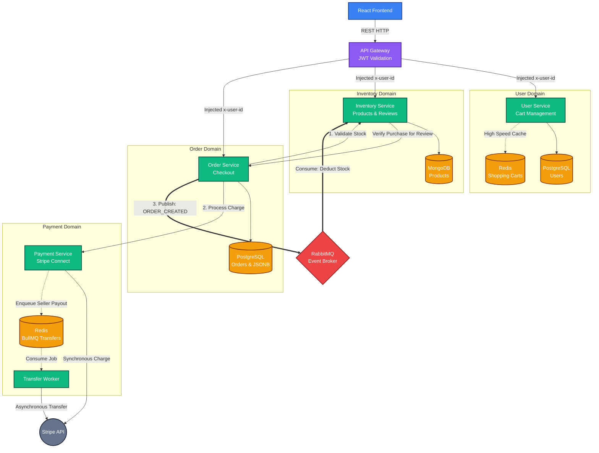

# Orbit - Modern E-Commerce Microservices Platform

Orbit is a highly scalable, multi-vendor e-commerce platform built using a modern **Microservices Architecture**. It demonstrates enterprise-grade patterns including Event-Driven messaging, Distributed Background Jobs, Polyglot Persistence, and API Gateway routing.

## Architecture Overview

The backend is composed of five specialized microservices and an API Gateway, all orchestrated together.

### High-Level Design (HLD) Diagram



### 1. API Gateway (`/api-gateway`)
* **Role**: The single entry point for the React frontend.
* **Key Feature**: **JWT Header Propagation**. It intercepts requests, verifies JWT tokens, and injects the `x-user-id` header before routing traffic to the internal microservices. This ensures internal services are secure and never have to manually parse JWTs.

### 2. User Service (`/user-service`)
* **Role**: Manages user authentication, profiles, and shopping carts.
* **Database**: PostgreSQL (Sequelize) for structured user data, and **Redis** for blazing-fast Guest & Logged-in Shopping Carts.

### 3. Inventory Service (`/inventory-service`)
* **Role**: Manages the product catalog, stock levels, and user reviews.
* **Database**: **MongoDB (Mongoose)**. Uses NoSQL for highly flexible product attributes and embedded document caching (e.g., caching `averageRating` directly on the Product document).
* **Key Feature**: Consumes RabbitMQ messages to asynchronously deduct stock after successful orders.

### 4. Order Service (`/order-service`)
* **Role**: Handles checkout validation, pricing consistency, and order history.
* **Database**: PostgreSQL. Uses `JSONB` arrays to take immutable snapshots of product prices at checkout, ensuring historical receipts never change even if a seller updates a product's price later.
* **Key Feature**: Publishes `ORDER_CREATED_QUEUE` events to **RabbitMQ** to trigger asynchronous inventory updates.

### 5. Payment Service (`/payment-service`)
* **Role**: Processes credit cards and splits payouts to third-party sellers using **Stripe Connect**.
* **Database**: Redis (BullMQ).
* **Key Feature**: **Charge-then-Split Architecture**. It charges the customer synchronously for a fast checkout experience, then pushes the 90% Seller Payout math problem into a **BullMQ** background worker for safe, highly-resilient processing with Exponential Backoff retries.

## Technology Stack

### Frontend
* **React** + **Vite** (Single Page Application)
* **TailwindCSS** (Styling)
* **Stripe Elements** (PCI-Compliant Credit Card forms)

### Backend
* **Node.js** & **Express**
* **Databases**: PostgreSQL (Relational), MongoDB (NoSQL Document), Redis (In-Memory Key/Value)
* **Message Brokers**: 
  * **RabbitMQ** (Inter-Service Pub/Sub Communication)
  * **BullMQ** (Intra-Service Background Jobs with Redis)
* **Payment Gateway**: Stripe API (Charges, Transfers, Connect Express Onboarding)

## 🧠 Key Enterprise Patterns Implemented

1. **Polyglot Persistence**: Choosing the right database for the job. Postgres for strict ACID compliance (Orders/Users), Mongo for flexible schemas (Products), and Redis for high-speed ephemeral data (Carts/Queues).
2. **Event-Driven Microservices**: Completely decoupling the Order Service from the Inventory Service using RabbitMQ. The checkout doesn't crash if the Inventory Service is temporarily offline.
3. **Dead Letter Queues & Exponential Backoff**: Using BullMQ in the Payment Service to ensure seller payouts are never lost if the Stripe API goes down. It automatically retries failing payouts over time.
4. **Data Denormalization**: Storing exact price snapshots inside a PostgreSQL `JSONB` array at the moment of checkout, rather than using standard Foreign Keys that would dynamically alter historical receipts.
5. **Secure Payment Flow**: Utilizing Stripe Public Keys on the frontend to generate safe tokens, ensuring raw credit card numbers never touch the Orbit Node.js backend (PCI Compliance).

## 🔌 API Endpoints Reference

All requests from the frontend are routed through the **API Gateway** on port `3000`.

### User Service (`/api/users`)
*Note: The `:userId` in the cart endpoints is dynamic. If the user is logged in, it must be their real JWT ID. If they are a guest, the frontend generates a temporary session string (e.g. `guest_abc123`).*

| Method | Endpoint | Description | Auth Required |
|--------|----------|-------------|---------------|
| `POST` | `/api/users/register` | Register a new user | No |
| `POST` | `/api/users/login` | Login and receive JWT | No |
| `POST` | `/api/users/refresh` | Refresh JWT using refresh token | No |
| `POST` | `/api/users/logout` | Logout user | No |
| `GET` | `/api/users/:id/stripe-account` | Get user's Stripe Connect ID | Yes |
| `PUT` | `/api/users/:id/stripe-account` | Save user's Stripe Connect ID | Yes |
| `GET` | `/api/users/:userId/cart` | Get shopping cart | No (Guest/Session ID) |
| `PUT` | `/api/users/:userId/cart` | Sync/Update shopping cart | No (Guest/Session ID) |
| `DELETE`| `/api/users/:userId/cart` | Clear entire cart | No (Guest/Session ID) |

### Inventory Service
*Note: The API Gateway dynamically routes to `/public` (unauthenticated) and `/secure` (JWT required).*

| Method | Endpoint | Description | Auth Required |
|--------|----------|-------------|---------------|
| `GET` | `/api/inventory/public/search` | Full-text search products | No |
| `GET` | `/api/inventory/public/` | Get all products | No |
| `GET` | `/api/inventory/public/:id` | Get specific product details | No |
| `GET` | `/api/inventory/public/seller` | Get all products by the logged-in seller | No |
| `GET` | `/api/inventory/public/:productId/reviews`| Get all reviews for a product | No |
| `POST` | `/api/inventory/secure/` | Create a new product listing | Yes |
| `PUT` | `/api/inventory/secure/seller/:id` | Update an existing product | Yes |
| `POST` | `/api/inventory/secure/:productId/reviews` | Leave a product review (verifies purchase) | Yes |

### Order Service (`/api/orders`)
| Method | Endpoint | Description | Auth Required |
|--------|----------|-------------|---------------|
| `POST` | `/api/orders/` | Validate stock, charge card, and create order | Yes |
| `GET` | `/api/orders/` | Get order history ("My Orders") | Yes |
| `GET` | `/api/orders/verify-purchase/:productId`| Internal: Verifies if user bought a product | Internal API |

### Payment Service (`/api/payments`)
| Method | Endpoint | Description | Auth Required |
|--------|----------|-------------|---------------|
| `POST` | `/api/payments/charge` | Internal: Processes Stripe Charge | Internal API |
| `POST` | `/api/payments/onboard` | Generates Stripe Connect Express link | Yes |
| `GET` | `/api/payments/account-status` | Checks Stripe Connect KYC verification status | Yes |

## Getting Started

### Prerequisites
- **Node.js (v18+)**: Required for running the microservices and frontend.
- **Docker & Docker Compose**: Required for spinning up the databases and message brokers locally without complex local installations.
- **Stripe Developer Account**: Required to get your `STRIPE_SECRET_KEY` and `VITE_STRIPE_PUBLIC_KEY`.

### 1. Infrastructure Setup (Docker)
This project uses Docker Compose to easily spin up all necessary databases and message brokers. 
Run the following command from the root directory:
```bash
docker-compose up -d
```
This will launch:
* **PostgreSQL** (Port `5434`): Used by User and Order services.
* **MongoDB** (Port `27017`): Used by Inventory service.
* **Redis** (Port `6380`): Used for Shopping Carts and BullMQ.
* **RabbitMQ** (Port `5672` & `15672`): Used for Order -> Inventory event messaging.

### 2. Environment Variables
You must create a `.env` file inside **each** microservice directory (`/user-service`, `/inventory-service`, etc.) and the `/frontend`. Ensure you add your Stripe keys to the Payment Service and Frontend.

### 3. Start the Backend Microservices
Because this is a microservices architecture, you need to start the API Gateway and all 4 services. Open 5 separate terminal tabs, navigate to each directory, and run:
```bash
npm install
npm run dev
```
* **API Gateway** runs on port `3000`
* **User Service** runs on port `3001`
* **Inventory Service** runs on port `3002`
* **Order Service** runs on port `3003`
* **Payment Service** runs on port `3004`

### 4. Start the React Frontend
Open a final terminal tab, navigate to the `/frontend` directory:
```bash
npm install
npm run dev
```
The application will be available at `http://localhost:5173`. 

---
